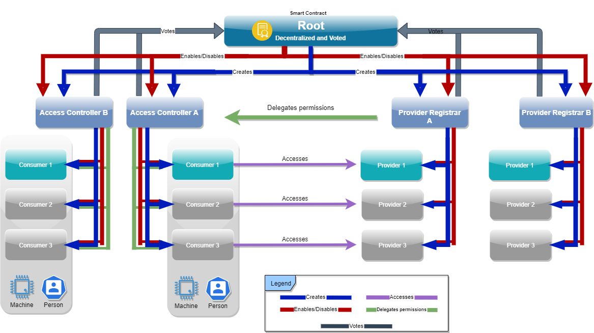

Copyright (c) 2021, Peaq Technology GmbH
# peaq Access overall technical description



---

Peaq access control is an Identity and Access Management system built on top of peaq’s Distributed Ledger Technology (DLT).  
Peaq access control offers convenience and advantages of security and decentralization in a performant manner to users and owners alike without relying on 3rd party systems.

## Root

Root is the super user entity of peaq access control that is empowered to add Provider Registrars (PR) and Access Controllers (AC).  
Root is controlled by a single entity or can be voted as such through consensus on the peaq DLT.

## Provider Registrar

Represents a service provider offering access points, resources, assets, decentralized identifiers and defined services.  
These resources and assets require authorization to be accessed and are represented by the “Provider” entity in peaq access control.

Upon entering into a contractual agreement with an access controller, the provider registrar can begin providing access to “providers” to the access controller who can then further associate the providers with consumers.

Additionally the provider registrar has the ability to “freeze” the contract with the access controller thereby preventing them from creating/modifying provider and consumer associations while leaving existing associations intact thereby having no impact on the users.

## Access Controller

Represents an organization which is the owner and “operator” of the “provider” resource or asset and manages “consumers” who have access and/or ownership to these providers.

Consumers “consume” an asset or resource and in peaq access control the consumers can optionally be associated with “Users” for ease of management.

The access controller entity also manages an abstract entity called “User” in peaq access control which could represent anything from a person to a self-driving vehicle. Users can be associated with one or many consumers to unlock theoretically unlimited possibilities.

## Provider

These are access points, resources , digital identities or assets that constitute a service offering. In peaq access control the provider registrar is responsible for defining, authorizing and managing providers while an access controller is responsible for associating them with consumers. Providers have an immutable data record which is kept on the peaq DLT.

> P = { x | x is anything that requires authorization to be accessed }

For example, P can consist of locks, digital identities, parking spots, cars etc

## Consumers

Consumers are entities which can be granted access to certain assets or resources (referred to as providers) and carry an immutable data record. A consumer is a logical entity that can optionally be associated with a user in which case the user is granted access to the resource pointed to by the consumer.

Consumers are authorized by access controllers and execute transactions on the peaq DLT for service, data or assets offered by a provider.

> C = { y | y is anything that is authorized to access something }

For example, C can consist of human beings, access cards, keys, consents etc

## Users

peaq “users” (hereafter referred to as simply users) is a utilitarian feature that provides a convenient and familiar bridge interface between non DLT systems and peaq’s DLT based access control. Users encapsulate the public keys necessary for interacting with the DLT; users can be machines/devices or persons.

In peaq access control, an end-user (device, person, etc.) can have access to many access points via many public keys and users provide a convenient access to these keys. Due to it’s versatile foundations, peaq access control leaves the final integration designs to the integrators all the while providing low and high level interfaces for communication.

> U = { z,y | y ϵ C, z = meta-data, ∀ C<sub>i</sub>⊆AC<sub>i</sub>}

Users are a set of consumers.

## User Groups

User groups facilitate management of users by establishing relationships between one or more providers and one or more users. This is a purely utilitarian feature which makes it convenient for access controllers to manage access to providers with ease. Any user participating in a specific group gets access to all providers part of that group.

For example, in a very common situation where all employees should have access to the main door of the office, a group containing all employee users is created and the main office door is added to the group. This group can be made to grant access to the main door, or any other shared space.

> G = { x,y | x ϵ P and y ϵ C }

Groups consist of Providers and Consumers.

## History

Allows authorized users to view the historical records about access to providers by the consumers (representatives of users). As the only retained information on the peaq DLT is non-identifying public identifiers, the system administrator is empowered to remove all other identifiable information from the system ensuring GDPR compliance while still retaining impersonal consumer and provider relationship as well as transactions on the DLT.

History helps establish important facts such as who accessed a particular provider at a given time, or which providers were accessed by a specific user at a particular time.

## Analytics

Having GDPR compliant data storage allows analytics to be performed to gain insightful usage information. This can greatly help optimize and understand any underlying causes.

These analytics can bear fruitful insights such as what time is a particular resource most utilized or how many times in a month an action is performed, or under what circumstances errors are observed or transactions are declined.

## Search

Facilitates with finding relevant information about transactions and smart contracts, consumers, users etc. Search allows an authorized user to search records related to access control, users, groups, consumers, providers and is an unified view of the distributed system.

Owing to the underlying DLT of peaq access control, the search feature is available anonymously to the users using a blockchain explorer.

## Example use cases for peaq access control

### Decentralised Parking
**GRANT IF**
```
    (provider == authenticated)  
    &&  
    (consumer == authenticated)  
    &&  
    (consumer.parking.authorized == true) -> provider.parking.autor = init
```

Alice owns a parking slot in a crowded city with rare parking possibilities and wants to make it available to the public whenever she is not using it. However, she doesn’t want to sign up to an expensive third party subscription to handle parking sessions for her.

Using peaq access, Alice’s parking slot becomes visible to Bob so that he can select it for reservation. Bob requests to reserve the parking slot for 2h. Bob’s car (Consumer) initiates the reserve request via smart contract for the parking slot (Provider). 

The smart contract then validates that Bob has sufficient funds and blocks the required amount. The authentication is successful and Bob gets informed that the parking slot is reserved. The parking sensor at the parking slot is informed of the car’s identity (Consumer Public Key) to expect. 

Bob and his car arrive at the parking slot. Parking gets verified through the parking sensor which triggers a verification check via smart contract to validate the car's identity. After a successful check Bob’s car is authorized to park and the billing time starts. 

Once done with his parking session, Bob drives away and the parking sensor initiates the stop of the billing time which triggers the smart contract that checks how much parking time got consumed by Bob’s car and transfers the right amount (Pay-per-use) from the blocked funds to Alice.